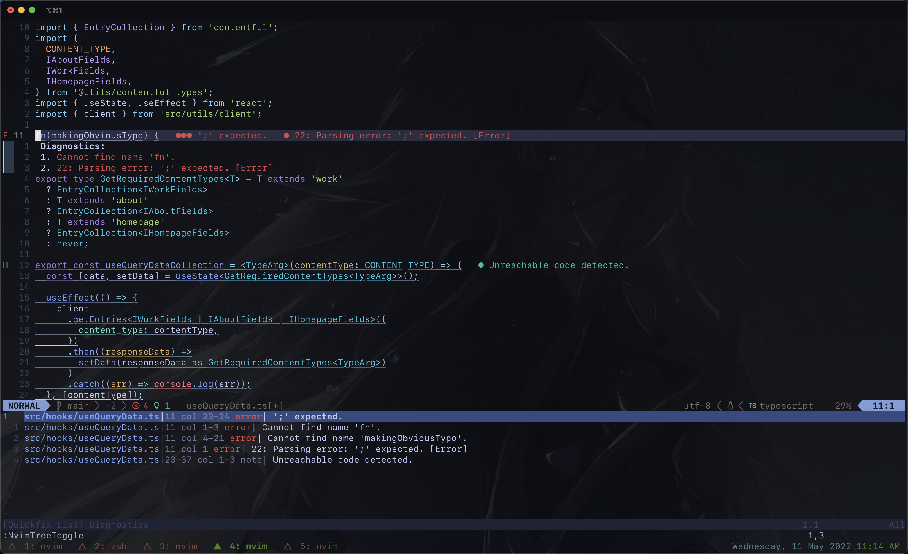
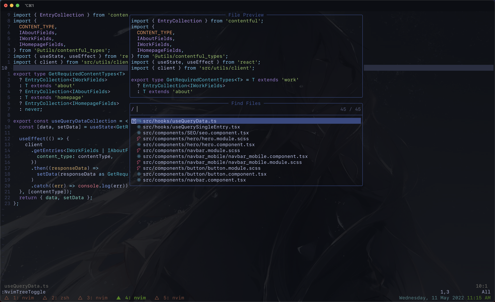

## Neovim + TMUX and other dotfiles/configurations

Running this on macOS Monterey 12.3.1 inside [iTerm2](https://iterm2.com/).

#### Nvim dotfiles currently working on Neovim v0.7.0, using the built-in LSP with plugins such as tree-sitter and nvim-cmp and telescope.

I use symlinks for these (see symlinks script)
This nvim config is mainly for web development (TypeScript, React, JavaScript, Go) and I will adjust it as I'm learning.

#### FORMATTING + LINTING (some are included in setup script)
* My null-ls uses black and flake8 (lint + format for Python), clang_format and cppcheck (for C++/C), gofmt and golangci_lint --- I installed all of these using brew.
* Prettier and ESLint were installed using npm
* StyLua requires Rust (cargo) to be installed

